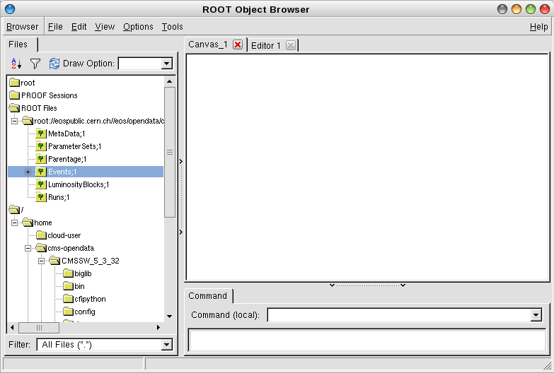
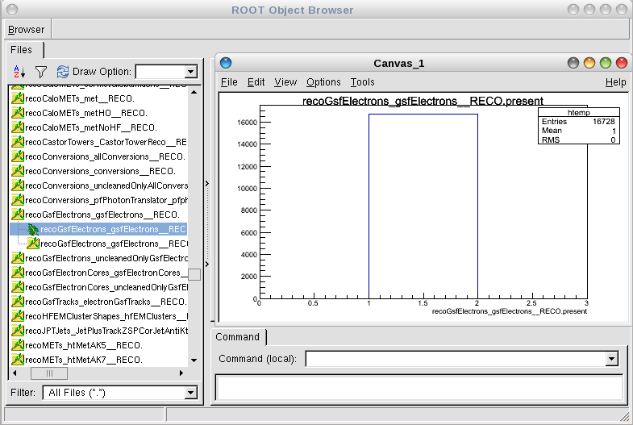

QuarkNet CMS Summer 2019
========================

Introduction
------------

This Github page serves to keep all files for the QuarkNet CMS Summer team. The
goal of this project is to make CMS data received from CERN more accessible in
it's native format, ROOT.

Note that each project (.csv file & ROOT file projects) have their own README, and act as standalone programs.

The *recommended* order to go through this page is the .csv project (forSpyder), then Outreach2011 (fromOutreach), then CMSData. This will introduce you to all concepts covered in our written program.

**It might be better to do the .csv project BEFORE going on to ROOT so you can understand the concepts in an easier to understand data format**

Table of Contents:
------------------

* ROOT

  * `What is ROOT?`_
  
  * `How to Install ROOT`_
  
  * `Basic ROOT Structure`_

* CernVM

  * `What is CernVM?`_
  
  * `How to Install and Use CernVM`_
  
  * `Using CernVM to Explore ROOT Files`_
  
  * `Installing this Github`_

* `CMSData`_

ROOT
====

What is ROOT?
-------------

ROOT is a file format developed and used by CERN to keep large amounts of data
organized and accessible. Each ROOT file serves as it's own directory, keeping
data in objects similar to jagged arrays. It is written and typically used in
C++, but has been integrated into both Python and R.

It is **not** required to download and build root on your native machine as it is already built on `CernVM`_, but is included in this readme as ROOT can be used for any kind of data analysis. **You do not need to install root to go through these programs.**

How to Install ROOT
-------------------

For `ROOT v6.18/00 <https://root.cern/content/release-61800>`_, the version used by our group, the
src can be downloaded using:

.. code-block:: bash

    git clone http://github.com/root-project/root.git
 
An installation guide for ROOT can be found `here <https://root.cern/downloading-root/>`_.

ROOT uses CMake as a build-generator, a process defined `here <https://root.cern/building-root>`_.

ROOT can be dowloaded and built on any device, however it is more useful when
it is used in CERN's virtual machine, CernVM.

Basic ROOT Structure
--------------------

ROOT is constructed like a tree. A TTree is a stored in a TFile, and is a collection
of TBranch objects. TBranch data is stored in smaller chunks, called TBaskets.

These files can be opened in order to read and write, which is most often done via
the TFile constructor.

More information on opening, writing, and creating ROOT files can be found `here <https://root.cern.ch/root-files/>`_.

CernVM
======

What is CernVM?
---------------

`CernVM <https://cernvm.cern.ch/>`_ is a virtual machine running Scientific Linux 7,
which is used to analyze data recieved from CMS. It is required to use CernVM with 
these programs, as many of the methods used only work on Scientific Linux 7. 

How to Install and Use CernVM
-----------------------------

First and foremost, `VirtualBox 5.2.2 <https://www.virtualbox.org/wiki/Download_Old_Builds_5_2/>`_ is needed to run CernVM. Scroll down to VirtualBox 5.2.20 and select the appropriate operating system.

Next download the CMS-specific CernVM image as OVA file from: `CMS VM Image <http://opendata.cern.ch/record/252>`_. This VM Image can be used for data from 2011 and 2012. Download the file named CMS-Open-Data-1.3.0.ova.

By double clicking the downloaded file, VirtualBox imports the image with ready-to-run settings. Then, you launch the CMS-specific CernVM, which boots into the graphical user interface and sets up the CMS environment. Be patient, it will take a while.

The first step to using CernVM is to download the CMS software package. This package 
includes the commands to start using root and run programs in the CMS console.
The following commands download CMSSW and load the software to run programs:

.. code-block:: bash

    cmsrel CMSSW_5_3_32       
    cd CMSSW_5_3_32/src       
    cmsenv                    
    scram b                   
 
Note that every time you open a terminal in CernVM or reload the linux kernel, **you have to enter cmsenv in the src directory before entering commands.** Not doing so will not load the commands required to use root.

Using CernVM to Explore ROOT Files
----------------------------------

Once CernVM and the required CMSSW files are installed, it is very easy to open and explore ROOT files. For this example we will use a file stored on CERN's servers.

If this is the first time opening the terminal in this session or you havent loaded CMSSW_5_3_32, enter:

.. code-block:: bash
    
    cd CMSSW_5_3_32/src       
    cmsenv                    
    scram b  

*Note that this has to be done each time you open a new terminal or reload the system*

Then enter the following:

.. code-block:: bash

    root root://eospublic.cern.ch//eos/opendata/cms/Run2011A/ElectronHad/AOD/12Oct2013-v1/20001/001F9231-F141-E311-8F76-003048F00942.root

This will bring up the ROOT command line, which you can use to navigate the files data. To open the easier to understand ROOT GUI, enter:

.. code-block:: bash

    TBrowser t

Double click on the file name (root://eospublic.cern.ch//...) and it will open like a folder, showing 6 subdirectories.

We are going to be focusing on *Events* since it holds all of the run data. Opening this might take a bit. Once The *Events* folder is opened, exploring the data is fairly simple. Double click on data directory that interests you, Gsf Electron data for example (recoGsfElectron_gsfelectrons__RECO.), and double click on the TTree object to bring up a graphic.

This should show all of the selected data in a graph.

Installing this Github
----------------------

To install this github and run the programs contained, enter the following:

.. code-block:: bash
    
    cd CMSSW_5_3_32/src  
    git clone https://github.com/QuarkNet-HEP/QuarkNet-CMS-Data-Summer-2019.git

Note that all runnable files need to be a subdirectory of CMSSW_5_3_32/src to function.

CMSData
=======

This is a simple analysis example to compute the spectrum of two muon final state with CMS Open Data.

It is based on the original code in [http://opendata.web.cern.ch/record/5001] on the CERN Open Data portal (Geiser, Achim. Dutta, Irene. Hirvonsalo, Harri. Sheeran, Bridget. (2017). Example code to produce the di-muon spectrum from a CMS 2011 or 2012 primary dataset. CERN Open Data Portal. DOI: 10.7483/OPENDATA.CMS.D00J.UVB1) and modified here for direct download from github. 

The modifications with respect to the original code are the following: 
- the class name has been changed from `DemoAnalyzer` to `cmsdata` in order to avoid conflict for any existing `DemoAnalyzer` plugins in the working area
- the file paths have been modified to be relative in the configuration file, i.e. they point to the `datasets` directory, which is under the directory from where there program will be run.

Run this code in [CMS Open Data VM](http://opendata.web.cern.ch/VM/CMS/2011).

If you have not installed the CMSSW area do the following:

.. code-block:: bash

    cmsrel CMSSW_5_3_32

If you already have, start directly with:

.. code-block:: bash

    cd CMSSW_5_3_32/src
    cmsenv

For this example, you need to create an additional directory, you can call it `cern` or choose another name.
Go to this directory, and download the example code.

.. code-block:: bash

   mkdir cern
   cd cern
   git clone git://github.com/QuarkNet-HEP/QuarkNet-CMS-Data-Summer-2019/tree/master/cmsdata.git

Go to the example directory, and compile with `scram b`. 

.. code-block:: bash

    cd cmsdata
    scram b

There are no imput files defined in the configuration file 'demoanalyzer_cfg.py' and no files in the 'datasets' directory, so you will need to find a DiMuon data set on cerns opendata website. An example of a good data set is one that is similar to this one: http://opendata.cern.ch/record/17. After you go to this page or find one sililar, you need to download the JSON.txt file and an index file into your datasets directory.

Run the example as configured in the configuration file. 

.. code-block:: bash

    cmsRun demoanalyzer_cfg.py
   
The output of the example is a root file containing several histograms, by default DoubleMu.root with 10000 input events (small subset of data). These can be looked at using a Root Browser.

There's a more detailed description in the cmsdata.cc file.
